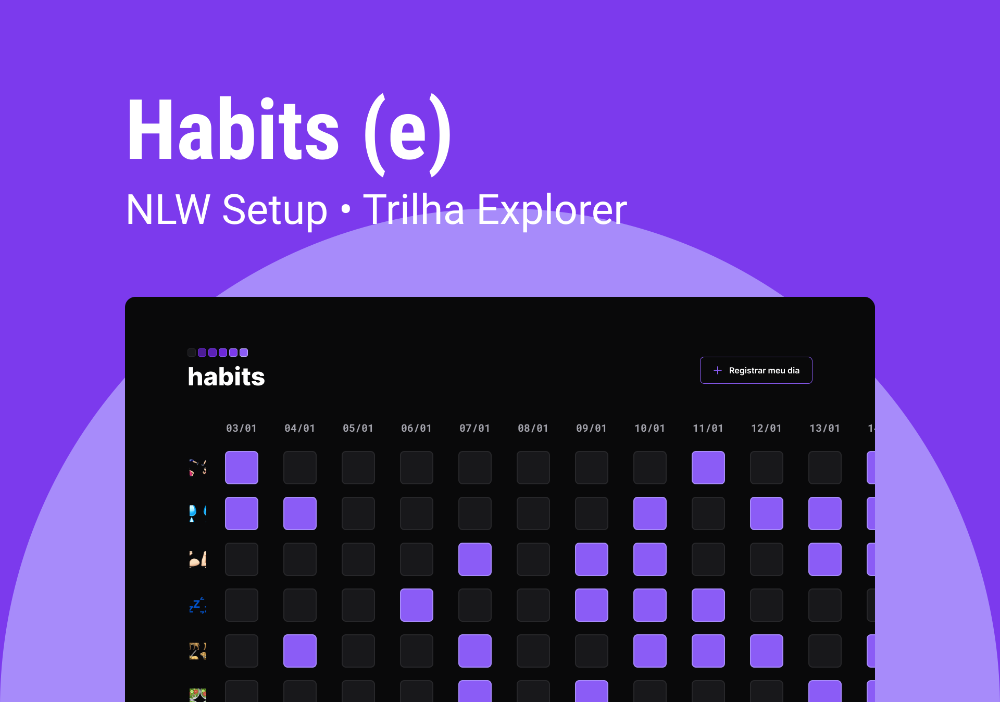

<h1 align="center"> Habits </h1>

NLW é programa exclusivo e gratuito, promovido pela Rocketseat para ensino de tecnologias WEB.  

  <a href="#-tecnologias">Tecnologias</a>&nbsp;&nbsp;&nbsp;|&nbsp;&nbsp;&nbsp;
  <a href="#-projeto">Projeto</a>&nbsp;&nbsp;&nbsp;|&nbsp;&nbsp;&nbsp;
  <a href="#-layout">Layout</a>&nbsp;&nbsp;&nbsp;|&nbsp;&nbsp;&nbsp;
  <a href="#memo-licença">Licença</a>

  

 

## 🚀 Tecnologias

Esse projeto foi desenvolvido com as seguintes tecnologias:

- HTML e CSS
- JavaScript
- Git e Github
- Figma

## 💻 Projeto

Habits é um app para ajudar a restaurar o habitos

- [Acesse o projeto finalizado, online](https://JoãoPolloni.github.io/NLW-Setup)

## 🔖 Layout

Você pode visualizar o layout do projeto através [DESSE LINK](https://www.figma.com/file/qkP1Y1VVF6Uhq22heRFDTL/Habits-(e)-(Community)-(Community)?t=zzocjJonnXQIDalA-1). É necessário ter conta no [Figma](https://figma.com) para acessá-lo.

## :memo: Licença

Esse projeto está sob a licença MIT.

---

Feito com ♥ by Rocketseat :wave: [Participe da nossa comunidade!](https://discord.gg/rocketseat)